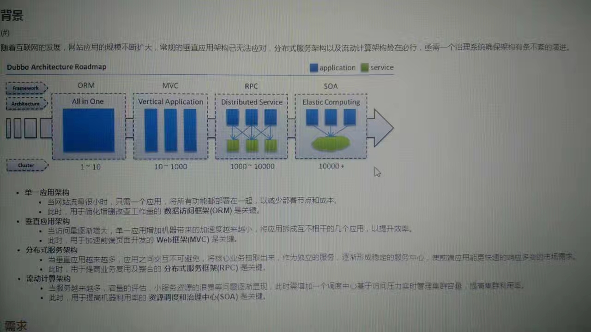

#第一篇 概述

##1 大型网站架构演化

大型互联网应用系统有如下特点：
*高并发，大流量
*高可用
*海量数据
*用户分布广泛，网络情况复杂
*安全环境恶劣
*需求快速变更，发布频繁
*渐进式发展

`技术是用来解决业务问题的，而业务的问题，也可以通过业务的手段取解决。`

##2 大型网站架构模式

*分层
*分割
*分布式
	*分布式应用和服务
	*分布式静态资源
	*分布式数据和存储
	*分布式计算，特点是移动计算，将计算分发到数据所在的位置以加速计算和分布式计算
	*分布式配置，支持网站线上服务器配置实时更新
	*分布式锁，分布式环境下实现并发和协同
	*分布式文件，支持云存储
*集群，多台服务器部署相同应用构成一个集群，通过负载均衡设备共同对外提供服务
*缓存
	*CDN，内容分发网络
	*反向代理
	*本地缓存
	*分布式存储
*异步，将一个业务操作分成多个阶段，每个阶段之间通过共享数据的方式异步直行进行协作
	*多线程共享内存队列
	*分布式消息队列
*冗余
	*服务器冗余运行，集群
	*数据库冗余备份，冷备份（定期备份，存档保存），热备份（主从分离，实时同步），灾备数据中心
*自动化
	*发布过程自动化
		*自动化代码管理
		*自动化测试
		*自动化安全检测
		*自动化部署
	*运行中自动化
		*自动化监控
		*自动化报警
		*自动化失效转移
		*自动化失效恢复
		*自动化降级
		*自动化分配资源
*安全
	*登录密码
	*手机校验
	*通信加密
	*数据加密
	*验证码
	*编码转换
	*过滤
	*风险控制

`山寨与创新的最大区别在于对问题和需求师傅真正理解与把握。`

##3 大型网站核心架构要素

#第二篇 架构

##4 瞬时相应：网站的高性能架构

*不同视角下的网站性能
	*用户
	*开发
	*运维
*性能指标
	*响应时间
	*并发数
	*吞吐量
	*性能计算器
*性能测试方法
	*性能测试
	*负载测试
	*压力测试
	*稳定性测试
*性能优化策略
	*性能分析
	*性能优化，根据网站分层架构
		*Web前端优化
			*浏览器访问优化
				*减少http请求
				*使用浏览器缓存
				*启用压缩
				*CSS在上，JavaScript在下
				*减少Cookie传输
			*CDN加速
			*反向代理
		*应用服务器性能优化
			*分布式缓存
			*异步操作
			*使用集群
			*代码优化
		*存储服务器性能优化
			*机械和固态
			*B+和LSM
			*RAID（廉价磁盘冗余阵列）和HDFS（Hadoop分布式文件系统）

##5 万无一失：网站的高可用架构

*可用性度量
	*网站不可用时间（故障时间）=故障修复时间点-故障发现（报告）时间点
	*网站年度可用性指标=（1-网站不可用时间/年度总时间）*100%
		99%，基本可用，<88小时
		99.9%，较高可用，<9小时
		99.99%，具有自动恢复能力的高可用，<53分钟
		99.999%，极高可用，<5分钟
*高可用的网站架构
*高可用的应用
*高可用的服务
*高可用的数据
*高可用的软件质量保证
*网站运行监控

##6 永无止境：网站的伸缩性架构
`指系统能够通过增加（减少）自身资源规模的方式增强（减少）自己计算处理事务的能力`
*不同功能进行物理分离实现伸缩
*单一功能通过集群规模实现伸缩

*应用服务器集群的伸缩性设计
	*HTTP重定向负载均衡
	*反向代理负载均衡
	*IP负载均衡
	*数据链路层负载均衡

*分布式缓存集群的伸缩性设计
*数据存储服务器集群的伸缩性设计

##7 随需应变：网站的可扩展架构
`指对现有系统影响最小的情况下，系统功能可持续扩展或提升的能力`
模块化 低耦合 高复用
*利用分布式消息队列降低系统耦合性
	*事件驱动架构（Event Driven Architecture）
	*消息队列（发布订阅模式）：通过消息对象分解系统耦合想，不同子系统处理同一消息
*利用分布式服务打造可复用的业务平台
	*通过接口分解系统耦合性，不同子系统通过相同的接口描述进行服务调用
	*拆分：纵向、横向
	*分布式服务框架，SOA，Dubbo
*可扩展的数据结构
*利用开放平台建设网站生态圈

##8 固若金汤：网站的安全架构
*网站攻击和防御
	*XSS攻击（跨站点脚本攻击），反射型和持久型，消毒和HttpOnly
	*注入攻击，SQL注入和OS注入，开源、错误回显、盲注，消毒、参数绑定
	*CSRF攻击（跨站点请求伪造），表单Token、验证码、Referer check
